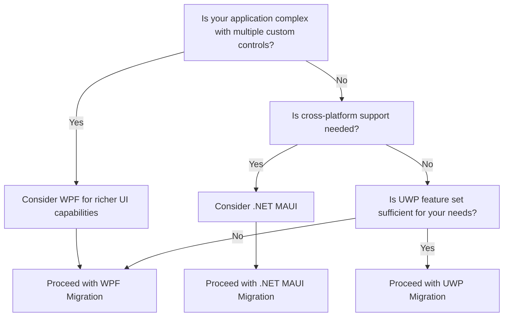

# Migrating WinForms to Modern Alternatives

## Overview

Windows Forms (WinForms) has been a popular framework for building Windows desktop applications. With the advent of newer technologies like WPF, UWP, and .NET MAUI, developers have more modern options. This guide outlines the best practices for migrating from WinForms to these platforms.

## Decision Tree for Migration



### Before Migration: WinForms Example

Here's a typical WinForms code snippet to create a button click event:

```csharp
private void button1_Click(object sender, EventArgs e)
{
    // Your logic here
}
```

### After Migration: WPF Example

In WPF, you might define a button click event like this:

```xaml
<Button Content="Click Me" Click="Button_Click" />
```

```csharp
private void Button_Click(object sender, RoutedEventArgs e)
{
    // Your logic here
}
```

### After Migration: .NET MAUI Example

In .NET MAUI:

```xaml
<Button Text="Click Me" Clicked="OnButtonClicked" />
```

```csharp
void OnButtonClicked(object sender, EventArgs e)
{
    // Your logic here
}
```

## Steps for Migrating

1. **Evaluate Current Application**: List out all forms, custom controls, and third-party libraries.
2. **Choose Target Framework**: Utilize the decision tree to choose between WPF, .NET MAUI, or UWP.
3. **Project Setup**: Create a new project based on the selected target framework.
4. **Migrate Business Logic**: Transfer non-UI code with minimal changes.
5. **Recreate UI**: Develop new UI using the target framework's native controls or libraries.
6. **Data Binding**: Replace manual data updates with native data binding.
7. **Testing**: Perform extensive testing to validate that the application works as expected.

## Known Issues, Incompatibilities, and Gotchas

- **Data Binding**: WPF and .NET MAUI offer more powerful data binding options compared to WinForms.
- **Custom Controls**: WinForms custom controls won't be directly compatible with WPF, .NET MAUI, or UWP.
- **Event Handling**: Event handling mechanisms can be different in modern frameworks.
- **Third-Party Libraries**: Not all WinForms-compatible libraries will be compatible with newer platforms.

## Additional Resources

- [Migrating from Windows Forms to WPF](https://docs.microsoft.com/en-us/dotnet/desktop/wpf/migration/convert-winforms?view=netdesktop-5.0)
- [.NET MAUI Documentation](https://docs.microsoft.com/en-us/dotnet/maui/)
- [UWP Documentation](https://docs.microsoft.com/en-us/windows/uwp/)

This document serves as a comprehensive guideline for migrating from WinForms to modern alternatives like WPF, UWP, and .NET MAUI. It includes a decision tree to help you choose the right migration strategy, sample code snippets, and tips for handling known issues and incompatibilities.
